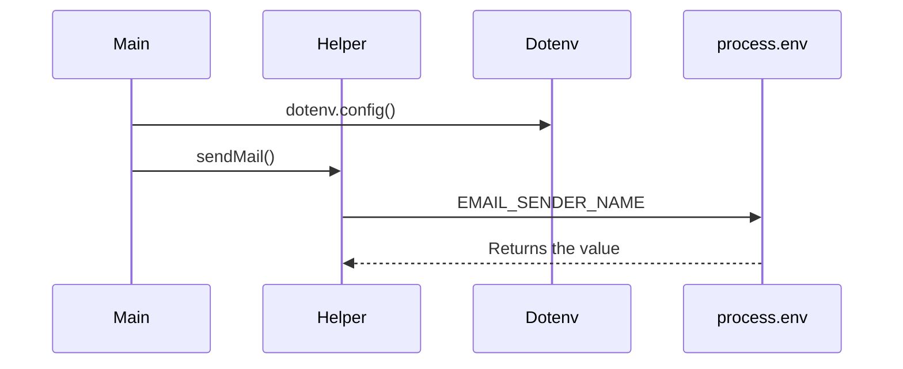

# 🍕 Full-Stack Pizza Delivery Platform

A full-stack pizza delivery platform built with the MERN stack (MongoDB, Express.js, React, Node.js) and **EJS** for server-side templating. This project features real-time order tracking, menu management, and user authentication. It's ideal for learning modern web development, practicing full-stack skills, or launching a pizza business.

---

## 🚧 Project Status

**Currently under development**. The platform is a work in progress, and new features are being added regularly. The core functionality has been implemented, but some features are still being fine-tuned.

---

## 🔧 Technologies to Be Used

- **MERN stack** (MongoDB, Express.js, React, Node.js):  
  The core stack for building the full-stack application. MongoDB will be used for database management, Express.js and Node.js will be used to create the backend API, and React.js will be used for building the frontend user interface.

- **EJS** for server-side rendering:  
  EJS (Embedded JavaScript) will be used to render dynamic HTML pages on the server side, providing a seamless user experience and allowing for real-time updates.

- **JWT (JSON Web Token)** for authentication:  
  JWT will be implemented for secure user authentication, enabling users to sign up, log in, and maintain sessions across the platform.

## Email System Flow

